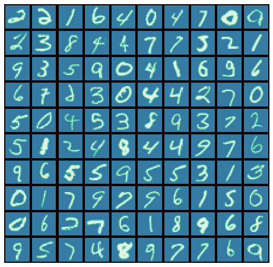
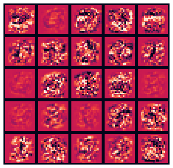
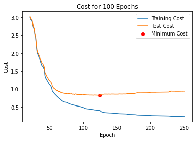
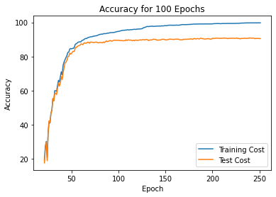
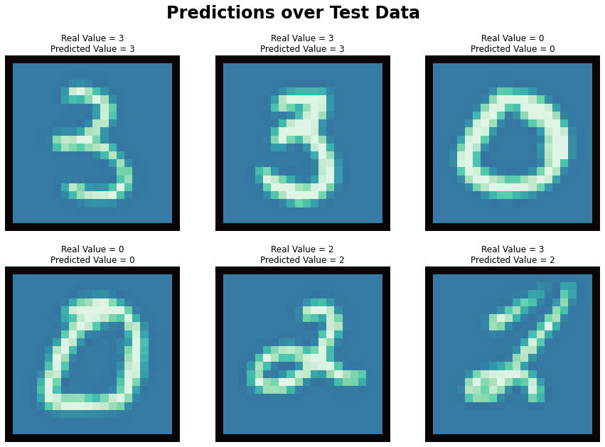
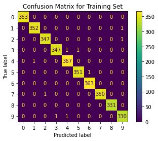
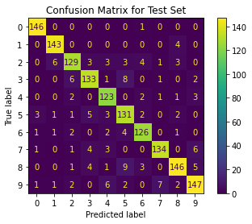

# MNIST Neural Networks

>## About this project

The MNIST database of handwritten digits, has a set of 5000 examples, each with a handwritten digit image and a corresponding label. The digits have been size-normalized and centered in a fixed-size image. Each training example is a 20 pixel by 20 pixel grayscale image of the digit.

We have printed here a few sample images of the training set.

Each of these images has got a label. The label is the number of the digit in the image.

> ## Neural Networks

We plan to design a neural network that can recognize the digits in the MNIST database. The network will have three layers, an input layer, a hidden and an output layer. The input layer will have 400 neurons, each representing a pixel in the image. The hidden layer will have 25 neurons, each representing a hidden node. 
The output layer will have 10 neurons. In which ith neuron will represent the probability of the ith digit(0-9).

> ## Training the Network

We divided the set into training set and set test. The split was 70-30. The training set is used to train the network. The test set is used to test the network.

We used to train the network using the backpropagation algorithm. The backpropagation algorithm is a simple algorithm that is used to train the network. The algorithm is based on the idea that the error in the output layer is the difference between the desired output and the actual output. The error in the hidden layer is the sum of the error in the output layer multiplied by the weights of the hidden layer.

To speed up the process, we used to `fmin_cg` function offered by scipy module. This function is used to minimize the cost function. The cost function is the sum of the squared error between the desired output and the actual output.

After training the Neural Network, to understand what your Neural Network is learning, we try to visualize the hidden units. We have 26 neurons in hidden layer (25 hidden units and 1 bias unit) and we have 10 neurons in the output layer. So we have 25*10 = 250 weights. We tried to visualize the weights in these hidden layer. 

Darker colors represent stronger weights (+1) while lighter colors represent weaker weights (-1). On the first glance it would seem that our algorithm is not learning anything. But it is. You can see some squares are completely red while some have a charachteristic chaotic pattern in the center while being smooth red at edges. This is indeed a sign that the algorithm is learning. Note that when we first initialized the weights, they were all random. From -1 to 1. So having such charachteristics is one way of saying that algorithm is working properly.

We ran the algorithm for 250 epochs. It took 22 secs for the algorithm to train over 3500 training sets.

The results were as follows:

> Model Complexity:

The model complexity is the number of parameters in the model. The model complexity is the number of weights in the model. It shows us that we tend to overfit the model. But by overfitting we get better results(dicussed later).

> Model Accuracy:

The Accuracy of test set keeps increasing after each epoch. This is because the algorithm is trying to learn the patterns in the training set. This, though overfits the data, gives us a better accuracy at test set.

> Results:

We got an accuracy of `99.94 %` on training set. Which means out of `3500` training samples, we got `3498` correct.
Also, we got an accucracy of `92.40 %` on test set which is very high. Out of `1500` test samples, we got `1386` correct.

We have printed here a few sample images from the test set and their prediction along with the actual label.

> ## Conclusion

For a better understanding of the results, we have plotted the confusion matrix for both, training set and test set.

> Confusion matrix for Training Set:

> Confusion matrix for Test Set:

